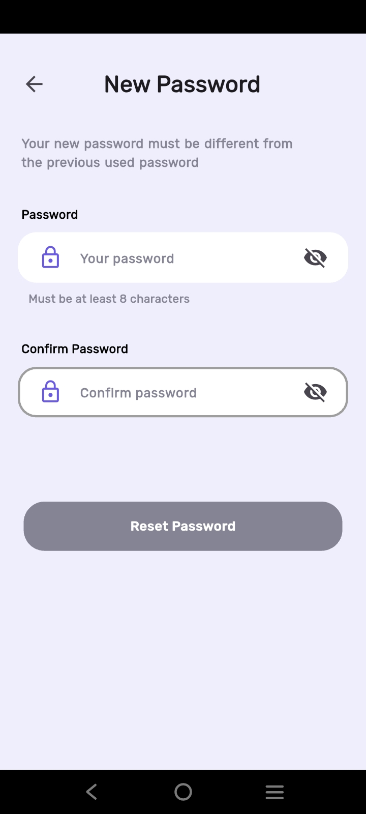
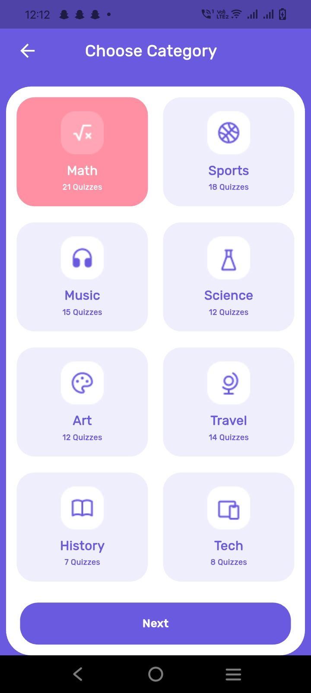
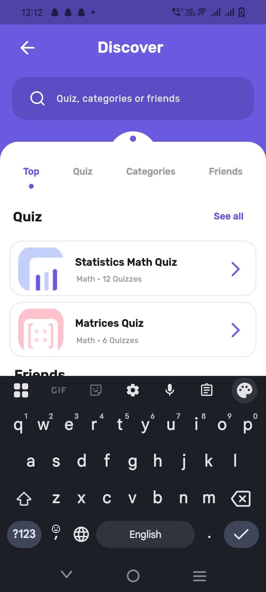
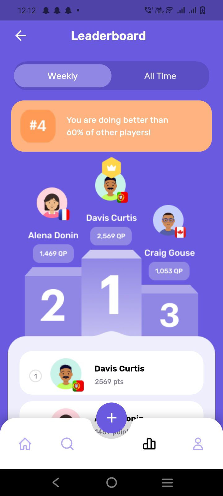
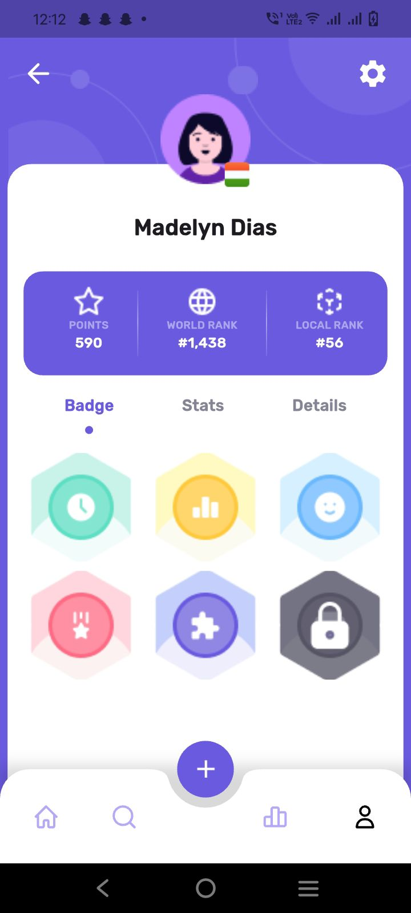
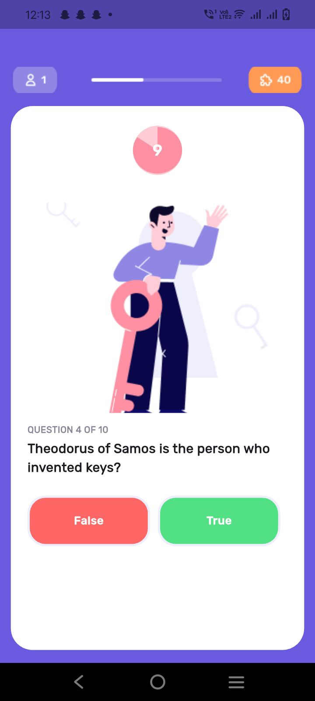
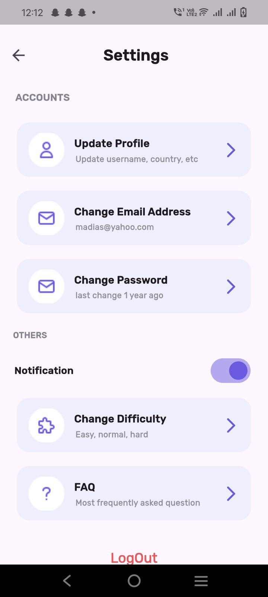

# queezy_app

Quizzy is a unique Flutter quiz app built with Dart, GetX, and MVVM. Users can sign in with Google, Facebook, or Email, create custom quizzes with various question types, and explore Home, Discover, Leaderboard, and Profile screens. Smooth UI, smart logic, and fun learning combined!

## Screenshots

  
  

  
  

  
  

  
  

  
  

  
  

  
  

  
  

  
  

